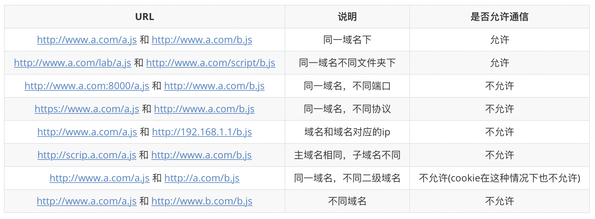
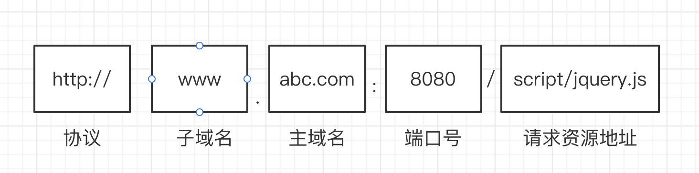

## 什么是跨域问题？

**当协议、子域名、主域名、端口号中任意一个不相同时，都算作不同域**。不同域之间相互请求资源，就算作 **“跨域”**。

### 常见的跨域场景


注：

1. **如果是协议和端口造成的跨域问题“前台”是无能为力的**
2. **在跨域问题上，仅仅是通过“URL 的首部”来识别而不会根据域名对应的 IP 地址是否相同来判断。“URL 的首部”可以理解为“协议, 域名和端口必须匹配”**

请求跨域，其实请求是正常发出并被服务端接收的，知识在响应结果返回时被浏览器拦截了。

### 同源策略

同源策略是一种约定，它是浏览器**最核心也最基本的安全功能**。如果缺少，那么浏览器就很容易遭到 XSS、CSRF 等攻击。

所谓同源是指：**"协议+域名+端口"三者相同**

一个域名地址的组成：



**同源策略限制的内容有**：

- Cookie、LocalStorage、IndexedDB 等存储性内容
- DOM 节点
- AJAX 请求发送后，结果被浏览器拦截了

但是有三个标签是允许跨域加载资源：

- ``
- `<link href='xxx'>`
- `<script src='xxx'>`

## 跨域解决方法

### 1. jsonp

**jsonp 的原理**

利用 `<script>` 标签没有跨域限制的漏洞，网页可以得到从其他来源动态产生的 JSON 数据。JSONP 请求一定需要对方的服务器做支持才可以。

**JSONP 和 AJAX 对比**

JSONP 和 AJAX 相同，都是客户端向服务器端发送请求，从服务器端获取数据的方式。

- 但 AJAX 属于同源策略
- JSONP 属于非同源策略（跨域请求）

**JSONP 的优缺点**

优点：简单兼容性好，可用于解决主流浏览器的跨域数据访问的问题

缺点：**仅支持 get 方法具有局限性,不安全可能会遭受 XSS 攻击**

**实现 JSONP 解决跨域问题**

```html
<!-- 简单的实现JSONP请求接口 -->
<body>
  <script>
    function fn(res) {
      console.log(res); //res接口返回的数据
    }
  </script>
  <script res="http://geek.itheima.net/v1_0/channels?callback=fn"></script>
</body>
```

在日常开发中遇到多个 JSONP 请求的回调函数名相同是我们就需要封装一个 JSONP 函数

```js
// (1) js封装JSONP
function jsonp({ url, params, callback }) {
  return new Promise((resolve, reject) => {
    let script = document.createElement("script"); //创建一个script标签
    //在window对象上挂载一个callback方法
    window[callback] = function (data) {
      resolve(data); //请求成功
      document.body.removeChild(script); //移除script标签
    };
    params = { ...params, callback };
    let arrs = [];
    for (let key in params) {
      arrs.push(`${key}=${params[key]}`);
    }
    script.src = `${url}?${arrs.join("&")}`; //给script的src属性赋值
    document.body.appendChild(script); //将script标签添加进body中
  });
}
jsonp({
  url: "http://geek.itheima.net/v1_0/channels",
  callback: "fn",
}).then((res) => {
  console.log(res); //返回值
});
```

```js
//(2) jquery使用jsonp
$.ajax({
  url: "http://geek.itheima.net/v1_0/channels",
  type: "get",
  dataType: "jsonp", // 请求方式为jsonp
  jsonpCallback: "fn", // 自定义回调函数名
  data: { wd: "a" }, //请求参数
});
```
```js
//(3) vue中使用jsonp
this.$http.jsonp('http://geek.itheima.net/v1_0/channels', {
    params: {wd:'a'},
  jsonp: 'show'}).then((res) => {
    console.log(res); 
})
```
### 2. CORS
**CORS**(Cross-origin resource sharing),全称是<u>"跨域资源共享"</u>。是W3C标准，允许浏览器向服务端发出`XMLHttpRequest`请求，从而克服了AJAX只能[同源](http://www.ruanyifeng.com/blog/2016/04/same-origin-policy.html)请求的限制。
#### CORS的优缺点
- 除了IE8+外的浏览器都支持此方案解决跨域问题，同时CORS也是主流的跨域解决方案。  
  (ps:IE8/9需要使用XDomainRequest对象来支持CORS)
- **整个CORS通信过程，都是浏览器自动完成**，不需要用户参与。对于开发者来说，CORS通信与同源的AJAX通信代码完全一样。浏览器一旦发现AJAX请求跨源，就会自动添加一些附加的头信息，有时还会多出一次附加的请求。  
- CORS与JSONP的使用目的相同，但是比JSONP更强大。JSONP只支持GET请求，CORS支持所有类型的HTTP请求。但是JSONP也有他的优势，可以支持版本更低的浏览器，也可以向不支持CORS的网站请求数据。
#### 简单请求和非简单请求
浏览器会将CORS的请求分为两种即**简单请求**和**非简单请求**。  
只有同时满足以下两种情况的才是简单请求：  
1. 请求方法是以下三种方法之一：`HEAD`，`GET`，`POST`
2. HTTP的头信息不超出以下几种字段：
   - Accept
   - Accept-Language
   - Content-Language
   - Last-Event-ID
   - Content-Type且值仅限于下列三者:`application/x-www-form-urlencoded`,`multipart/form-data`,`text/plain`

**简单请求**  
对于简单请求，浏览器直接发出CORS请求。具体来说，就是在头信息之中，增加一个`Origin`字段。
> Origin表示本次请求来自哪个源（协议 + 域名 + 端口），浏览器会根据这个值来确定是否统一此次请求 

如果Origin指定的源，不再许可范围内，服务器会给出一个正常的http响应。浏览器会发现这个响应头内没有包含`Access-Control-Allow-Origin`字段，就会抛出错误。然后被XMLHttpRequest的onerror回调函数捕获。
> 注意：这种错误无法通过状态码识别

如果Origin的指定源，在允许范围内，则服务器返回的响应，会多出几个头信息字段:
(1)Access-Control-Allow-Origin:  
该字段是**必须的**。它的值要么是请求时Origin字段的值，要么是一个`*`，表示接受任意域名的请求。
(2)Access-Control-Allow-Credentials:  
该字段可选。它的值是一个布尔值，表示是否允许发送Cookie。
(3)Access-Control-Expose-Headers:  
该字段可选。CORS请求时,拿指定响应头的字符串

**非简单请求**   
非简单请求是那种对服务器有特殊要求的请求，比如请求方法是PUT或DELETE，或者Content-Type字段的类型是application/json。  
它会在正式通信之前，增加一次HTTP查询请求，称为 **"预检"** 请求(preflight)。
除了Origin，"预检"的请求头还包含两个特殊字段：
- Access-Control-Request-Method：该字段是必须的，列出CORS使用的请求方式
- Access-Control-Request-Headers：指定CORS请求会额外发送的头信息字段

预检请求的回应：服务器收到"预检"请求以后，检查完请求字段，确认允许跨源请求，就可以做出回应。返回的响应头中会携带
```js
Access-Control-Allow-Origin: * //表示同意任意跨源请求
```  
如果不同意控制台会打印出以下报错信息
```js
XMLHttpRequest cannot load http://api.alice.com.
Origin http://api.bob.com is not allowed by Access-Control-Allow-Origin.
```
一旦通过了"预检"之后，以后每次浏览器正常的CORS请求，就都跟简单请求一样，会有一个`Origin`头信息字段。服务器的回应，也都会有一个`Access-Control-Allow-Origin`头信息字段。 
附上：[阮一峰的文档](http://www.ruanyifeng.com/blog/2016/04/cors.html)方便想了解更多
### 3.document.domain + iframe跨域
> 场景：仅限主域相同，子域不同的跨域  
> 原理：通过js强制设置document.domain为基础主域，就实现了同域
### 4.postMessage跨域
> HTML5为了解决这个问题，引入了一个全新的API：跨文档通信 API。这个API为window对象新增了一个window.postMessage方法，允许跨窗口通信，不论这两个窗口是否同源

postMessage方法的第一个参数是具体的信息内容，第二个参数是接收消息的窗口的源（origin），即"协议 + 域名 + 端口"。也可以设为*，表示不限制域名，向所有窗口发送。  
解决了以下问题：
```
a.） 页面和其打开的新窗口的数据传递
b.） 多窗口之间消息传递
c.） 页面与嵌套的iframe消息传递
d.） 上面三个场景的跨域数据传递
```
了解更多---[九种跨域方式实现原理](https://juejin.cn/post/6844903767226351623#heading-12)